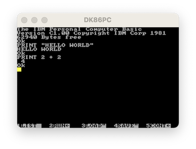

# DK86PC
A WIP attempt to write an Intel 8086 emulator... and eventually an original IBM PC 5150 emulator.

It's at the point where it gets through booting the BIOS and gets to the IBM Casette BASIC (I haven't made much progress on the floppy disk controller to boot DOS). But everything is a syntax error—I think because of the u character being inserted at the end of each line: 

If someone wants to help me finish it, I'd be happy for the help. Right now most of the 8086 (8088 technically but no difference at this point) is done, memory works, CGA has text mode support, and a basic implementation of most of the essential support chips is done (PIC, PIT, etc.). It's an Xcode project but the only dependencies are SDL and SDL_TTF so it can easily be ported to other platforms.

I've run some automated CPU tests and the CPU is reasonably good, but is still missing a few instructions. I wrote it all by hand using Intel/IBM/online documentation, only looking at other emulators when I got really stuck for a particular specific item.

The emulator I've found most helpful as a reference is [this Java one](https://github.com/NeatMonster/Intel8086) by @NeatMonster. And [this C one](https://github.com/mikechambers84/XTulator/tree/master/XTulator/modules/video) by @mikechambers84.
